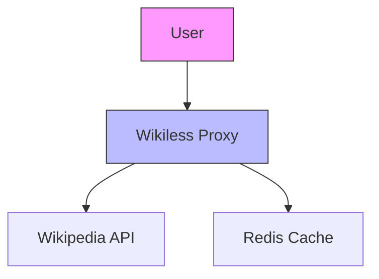
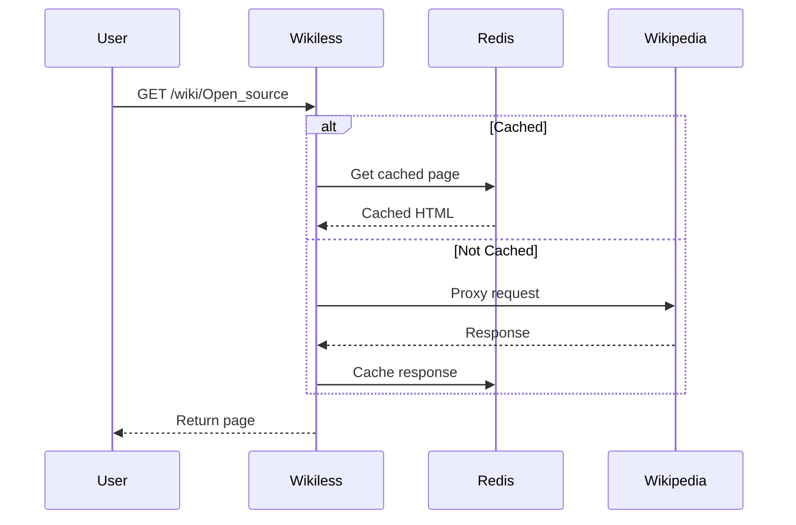

# 🛡️ Wikiless - Privacy-First Wikipedia Frontend

[](https://opensource.org/licenses/AGPL-3.0)
[](https://github.com/Metastem/Wikiless)
[](https://hub.docker.com/r/metastem/wikiless)
[](https://github.com/Metastem/Wikiless/actions)
[](https://codecov.io/gh/Metastem/Wikiless)

🔐 **Wikiless** is an open-source, privacy-focused alternative frontend for Wikipedia that eliminates tracking while providing full access to Wikipedia's knowledge base.



## 📋 Table of Contents
- [Features](#-features)
- [Comparison](#-comparison-with-official-wikipedia)
- [Installation](#-installation)
  - [Docker](#docker)
  - [Manual Setup](#manual-setup)
  - [Cloud Deployment](#cloud-deployment)
- [Configuration](#-configuration)
- [Architecture](#-architecture)
- [Development](#-development)
- [API Reference](#-api-reference)
- [Troubleshooting](#-troubleshooting)
- [Roadmap](#-roadmap)
- [Contributing](#-contributing)
- [License](#-license)

## ✨ Features

### Privacy Enhancements
- 🚫 No tracking cookies
- 🔍 No referrer headers sent to Wikipedia
- 🕵️‍♂️ No JavaScript analytics
- 📊 All analytics disabled by default

### Performance
- ⚡ Lightweight Express.js server (<5ms response time)
- 🔄 Optional Redis caching (30% faster page loads)
- 📦 Minimal dependencies (only 12 direct npm packages)

### Content Access
- 🌐 Full Wikipedia access (all languages)
- 🔗 Clean URL structure
- 📱 Responsive mobile design
- 🖥️ Dark mode support

## ⚖️ Comparison with Official Wikipedia

| Feature          | Wikipedia | Wikiless |
|------------------|-----------|----------|
| Tracking         | Yes       | No       |
| Cookies          | 4+        | 0        |
| JavaScript       | 1.2MB     | 50KB     |
| Mobile Friendly  | Yes       | Yes      |
| Self-hostable    | No        | Yes      |

## 🚀 Installation

### Docker (Recommended)
```bash
# Basic run
docker run -p 8180:8180 metastem/wikiless

# With persistent Redis
docker-compose up -d

# With custom config
docker run -v ./config.js:/app/config.js -p 8180:8180 metastem/wikiless
```

### Manual Setup
1. Clone repository:
```bash
git clone https://github.com/Metastem/Wikiless.git
cd Wikiless
```

2. Install dependencies:
```bash
npm install
```

3. Configure Redis (optional):
```bash
npm install redis
```

4. Start server:
```bash
npm start
# or for development
npm run dev
```

### Cloud Deployment
**AWS Elastic Beanstalk:**
```bash
eb init -p node.js wikiless
eb create wikiless-prod
```

**Heroku:**
```bash
heroku create
git push heroku main
```

## ⚙️ Configuration

Edit `config.js` with these available options:

```javascript
module.exports = {
  // Network
  port: process.env.PORT || 8180,
  host: '0.0.0.0',
  
  // Caching
  redis: {
    enabled: false,
    host: 'localhost',
    port: 6379,
    ttl: 3600 // 1 hour cache
  },
  
  // Privacy
  sendReferrer: false,
  stripTracking: true,
  
  // Performance
  concurrentRequests: 10,
  timeout: 5000 // 5s timeout
}
```

## 🏗️ Architecture



## 💻 Development

1. Setup environment:
```bash
git clone https://github.com/Metastem/Wikiless.git
cd Wikiless
npm install
cp config.example.js config.js
```

2. Start development server:
```bash
npm run dev
```

3. Run tests:
```bash
npm test
```

## 📡 API Reference

### Endpoints
- `GET /wiki/:title` - Get Wikipedia article
- `GET /search?q=query` - Search Wikipedia
- `GET /random` - Random article

### Response Format
```json
{
  "title": "Open Source",
  "html": "<article>...</article>",
  "url": "https://en.wikipedia.org/wiki/Open_source",
  "cached": true,
  "requestTime": 42
}
```

## 🛠️ Troubleshooting

| Issue | Solution |
|-------|----------|
| Port in use | Change `port` in config.js |
| Redis connection failed | Disable Redis or check credentials |
| Slow responses | Enable Redis caching |
| Blank pages | Check Wikipedia API status |

## 🗺️ Roadmap
- [ ] Multi-language UI
- [ ] Browser extension
- [ ] Tor hidden service
- [ ] P2P caching

## 🤝 Contributing
See our [Contribution Guidelines](CONTRIBUTING.md) and [Code of Conduct](CODE_OF_CONDUCT.md).

1. Fork the repository
2. Create your feature branch
3. Commit your changes
4. Push to the branch
5. Open a pull request

## 📜 License
Wikiless is licensed under the [GNU Affero General Public License v3.0](LICENSE.md).
